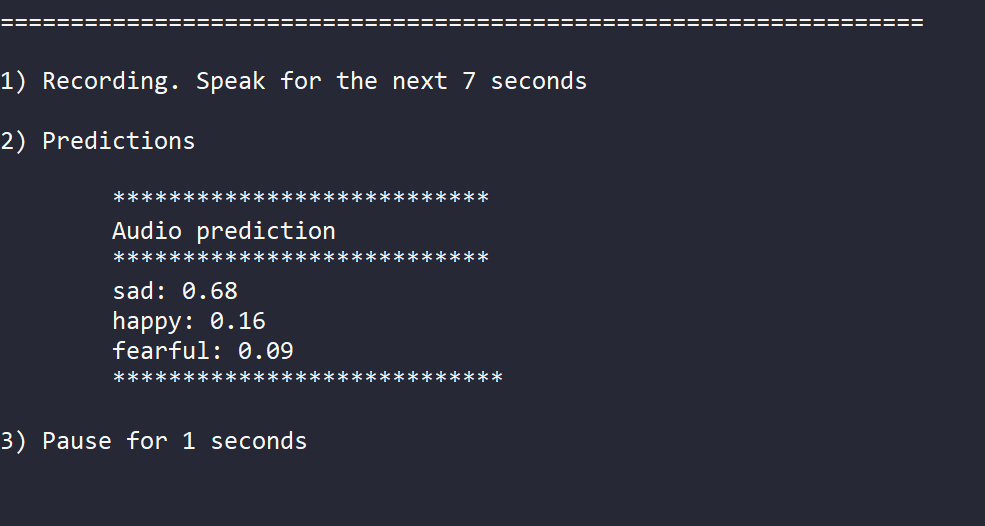

# STERN Audio module

## Repository structure

## Requirements

## Tutorials (Use cases)

### Preprossing 

[Feature extraction](./docs/feature_Extraction.md)

### Training 

[Training](./docs/Training.md)

### Retraining
[Retraining](./docs/Retraining.md)

### Sentiment Analysis
This example shows how to perform tone sentiment analysis using the ```stern_audio.py``` script. This script requires a configuration file to load the (re)trained tone detection model and setup the properties required for sentiment analysis. A detailed description about how this script works is available in the [sentiment analysis process document](./docs/sentiment_analysis.md).

First, update the contents of the configuration files that can be used for tone sentiment analysis: either ```src\raspi_candidate_config.yml```or ```src\raspi_deployment_config.yml```. The contents of ```src\raspi_candidate_config.yml``` are shown below.

```
model:
 dir: "seq_3conv_modules_5emotions_ret/saved_models"
 file: "Emotion_Voice_Detection_Model.h5"
 type: "Sequential"
 n_mfcc: 50

test_data_dir: "./prod_data/test"
prod_models_dir: "./prod_models/candidate"

#audio recording properties
audio_channels: 1
audio_frequency: 22050 
audio_length: 7

#list of emotions being used in the prediction
#These codes should comply with the feature extraction part in training code
emotions:
  0: "neutral"
  1: "happy"
  2: "sad"
  3: "angry"
  4: "fearful"

# interaction properties
iterations: 2 # for an infinite number of iterations, use -1
after_audio_analysis_pause: 1 # length of pause in seconds
before_recording_pause: 1

# logging
logging_directory: './logs'
logging_file_prefix: 'test_logging_file'
```

This configuration indicates that:
* The ```Emotion_Voice_Detection_model.h5``` model inside the ```seq_3conv_modules_5emotions_ret/saved_models``` directory will be used for sentiment analysis.
* A frequency of 22050hz will be used to record audios.
* The length of each recorded audio will be 7 seconds.
* Only five emotions will be detected.

Once the configuration file has been modified, execute the sentiment analysis script using the command below. For this example, we use the ```src\raspi_candidate_configuration.yml``` file.

```python src\stern_audio.py src\raspi_candidate_configuration.yml```

The image below shows an output of the sentiment analysis script.




### Test
[Test](./docs/Test.md)