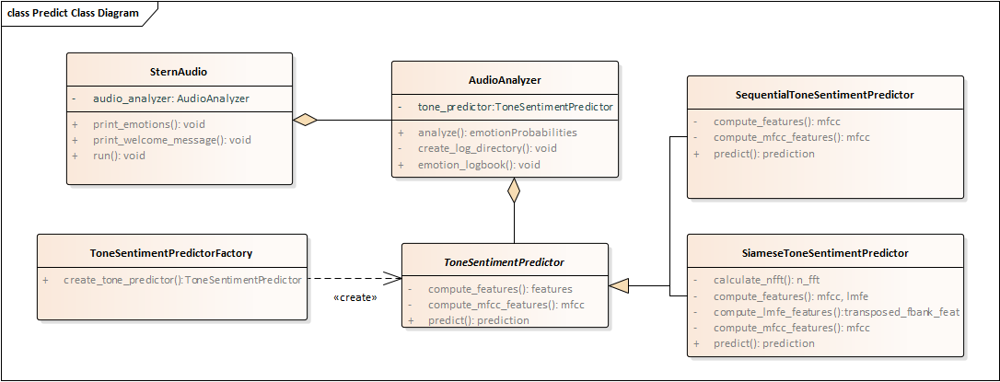

## Emotion recognition

This document describes the design, configuration, and usage of the emotion recognition (prediction) software that can be executed on both a PC and a Raspberry Pi.

### Design
The emotion recognition software uses a tone-based CNN model to detect emotions in audios. The components of this software are shown in the class diagram below. Overall, the classes in this diagram belong to one of the following categories: emotion recognition engine, audio analyzer, and tone-based emotion predictor. The implementation of these class diagrams is available in the ```src``` folder of the source code. 




#### Emotion recognition engine
The emotion recognition engine handles the general emotion recognition process. This engine reads input audio from a  microphone or directory then displays the emotions predicted for each input audio. The ```SternAudio``` class models the functionality of this engine and the ```stern_audio.py``` script implements such functionality. 

Overall, ```SternAudio``` performs emotion recognition in a loop as follows:
1. read input audio from a microphone or directory
2. analyze the audio using an implementation of the ```AudioAnalyzer``` class
3. display the recognized emotions
4. pause for a short period before going back to step 1 in case of reading from the microphone

The emotion recognition engine's behavior can be altered by modifying the following configuration properties: ```audio_length```, ```audio_frequency```, ```audio_channels```, ```before_recording_pause```, ```after_audio_analysis_pause```, and ```iterations```. In the [Configuration section](#configuration), we describe these configuration properties.

#### Audio analyzer
The audio analyzer uses a tone-based emotion predictor to compute the emotions associated with given audio. The ```AudioAnalyzer``` class in the class diagram models the audio analyzer's functionality, while the implementation of such functionality is available in the ```sentiment_analyzer.py``` file. 

Overall, the ```AudioAnalyzer``` works as follows: 
1. given input audio, compute emotions using an implementation of a ```ToneSentimentPredictor```
2. preprocess the predicted emotions to human-readable messages that can be shown to the users of the emotion recognition software
3. Log the predicted emotions into a file specified by the user

The behavior of the ```AudioAnalyzer``` can be altered by modifying the following configuration properties: ``` input_type```, ```input_directory```, ```audio_frequency```, ```emotions```, ```logging_subdirectory_prefix```, and ```logging_directory```. In the [Configuration section](#configuration) we describe these configuration properties.

#### Tone-based emotion predictor
The tone-based emotion (sentiment) predictor is responsible for computing features from a input audio and analyzing these features to predict its emotions. In the class diagram shown above, the sentiment predictor is modeled by the ```ToneSentimentPredictor``` class. As shown in the class diagram, two specialized sentiment predictors inherit from this class: ```SequentialToneSentimentPredictor``` and ```SiameseToneSentimentPredictor```. 

The ```SequentialToneSentimentPredictor``` class uses sequential CNN models trained with mfcc features. Therefore, in order to perform sentiment prediction using its CNN model, this class computes mfcc features of given audio. In contrast, the ```SiameseToneSentimentPredictor``` uses siamese CNN models trained using mfcc and lmfe features. Thus, this class computes mfcc and lmfe features in order to predict the sentiment of given audio.

The ```sentiment_prediction.py``` file the implementations of ```SequentialToneSentimentPredictor``` and ```SiameseToneSentimentPredictor```. The ```ToneSentimentPredictor``` class is part of the design but was not implemented. Nonetheless, if more tone-based predictors classes are required, the ```ToneSentimentPredictor``` could be implemented in order to couple the functionality of new tone-base predictors with the required interface.

The behavior of the implemented tone-based emotion predictor classes can be altered by modifying the following configuration properties: ```prod_models_dir```, ```model_dir```, ```model_name```, ```model_type```, ```audio_frequency```, and ```n_mfcc```. In the [Configuration section](#configuration) we describe these configuration properties.

### Configuration
Users of the emotion recognition software can configure its behavior using one of the two configuration files available in the ```src``` directory: ```raspi_candidate_config.yml``` and ```raspi_deployment_config.yml```. These configuration files contain the parameters required by the emotion recognition engine, the audio analyzer, and the tone-based sentiment predictors. As both configuration files contain the same parameters, both can be used to configure the emotion recognition software. Nonetheless, we recommend using ```raspi_candidate_config.yml``` during the development process and using ```raspi_deployment_config.yml``` to execute the code in the Raspberry Pi.

These configuration files contain the following parameters:
* ```input_type``` is a value that indicates whether audios are recorded from a microphone (```"mic"```) or loaded from a directory (```"recorded"```).
* ```input_directory``` indicates the directory containing recorded audios to be analyzed. This property is used only when the ```input_type``` is set to ```"recorded"```.
* ```test_data_dir``` corresponds to the directory containing test data. This value is used by the testing scripts inside the ```tests``` directory.
* ```prod_models_dir``` is the path of the directory that contains candidate models for emotion recognition (sentiment prediction). This path must also be specified relative to the root folder of the source code repository.
* ```model``` corresponds to a dictionary containing information about the tone-based model to be used for sentiment prediction.
    * ```model_dir``` corresponds to the path of the directory that contains the tone-based model to be used by emotion recognition software. This path must be indicated relative to the directory indicated in the ```prod_models_dir``` parameter.
    * ```model_name``` corresponds to the name of the ```.h5``` model inside ```model_dir```.
    * ```model_type``` indicates the type of tone-based detection model. Currently, the emotion recognition software supports two types: ```sequential``` and ```siamese```. The ```sequential``` type is related to the class ```SequentialToneSentimentPredictor``` and the ```siamese``` type to the class ```SiameseToneSentimentPredictor```.
    * ```n_mfcc``` corresponds to the number of mfcc features to be computed by the ```ToneSentimentPredictor``` classes. This value affects the shape of the input feature arrays used for sentiment prediction. Therefore, it must match the ```n_mfcc``` value inside the ```training/training_parameters.yml``` file.
* ```audio_channels``` is the number of channels used to record audios. For instance, value 1 indicates a mono audio and value 2 indicates a stereo audio. This property is used only when the ```input_type``` is set to ```"mic"```.
* ```audio_length``` is the length (in seconds) of the audios to be recorded or loaded for analysis. The length of these audios must be the same as the length of the audios used to train the CNN models that perform sentiment prediction. The length of the training audios is given by the ```chunk_length_in_milli_sec``` parameter inside the ```training/training_parameters.yml``` and ```training/retraining_parameters.yml``` files. 
* ```audio_frequency``` corresponds to the frequency (in hertz) of the audios to be analyzed, which can be recorded from a microphone or loaded from a directory. This frequency must be the same as the frequency used to compute features from training audios (see the [Model Training document](./Training.md)). Some audio frequencies might not be supported by the microphone connected to the Raspberry Pi. For instance, the Raspberry Pi cannot record audio at 22.5Khz. 
*  ```emotions``` is a dictionary that maps numerical values representing emotions to names of these emotions. This dictionary is used to show the predicted emotions in a human-readable format. The values and names of the emotions in this dictionary must match with the labels used to train the tone-based detection model.
* ```iterations``` corresponds to the number of audios to be recorded from the microphone and analyzed. To indicate an infinite number of audios, set this value to ```-1```. This property is used only when the ```input_type``` is set to ```mic```.
* ```before_recording_pause``` corresponds to the number of seconds to pause after showing a message to the user indicating that the recording process is about to start. This pause helps the user to get ready before speaking to the microphone. This property is used only when the ```input_type``` is set to ```"mic"```.
* ```after_audio_analysis_pause``` is the number of seconds to pause after an audio record was analyzed. This property is used only when the ```input_type``` is set to ```"mic"```.
* ```logging_directory``` is the directory that stores the log files produced by the emotion recognition software. In case this directory does not exists, it will be created. This the path of this directory must be specified relative to the root folder of the source code repository. For instance, the following value ```logging_directory = "./logs"``` will create a ```logs``` directory at the same level as the ```src``` and ```training``` directories.
* ```logging_subdirectory_prefix``` corresponds to the prefix of the subdirectory that contains information about the predictions of the emotion recognition software. Each time the ```stern_audio.py``` script is executed, a new logging subdirectory (with prefix given by ```logging_subdirectory_prefix```) is created inside the ```logging_directory```.


Below, you can see an example of a configuration file (either ```raspi_candidate_config.yml``` or ```raspi_deployment_config.yml```).
model:
```
input_type: "mic" 
input_directory: "./prod_data/prediction" # used only with input_type "recorded"

# Parameters of models and data
test_data_dir: "./prod_data/test"
prod_models_dir: "./prod_models/candidate"

model:
    dir: "seq_3conv_modules_2layer_Raha_Siamese_44100/saved_models"
    file: "Emotion_Voice_Detection_Model.h5"
    type: "Siamese"
    n_mfcc: 50

# Audio recording properties
audio_channels: 1
audio_frequency: 44100 
audio_length: 7 

# User interaction properties
iterations: 2 # for an infinite number of iterations, use -1
after_audio_analysis_pause: 1 # length of pause in seconds
before_recording_pause: 1

# List of emotions used for prediction
emotions:
    0: "neutral"
    1: "happy"
    2: "sad"
    3: "angry"
    4: "fearful"

# Logging properties
logging_directory: './logs'
logging_file_prefix: 'test_logging_file'
```

### Usage
To use the audio emotion recognition software during development, run:

```
python src/stern_audio.py src/raspi_candidate_config.yml
```

To deploy the audio emotion recognition software on the Raspberry Pi, run:
```
python src/stern_audio.py src/raspi_deployment_config.yml
```