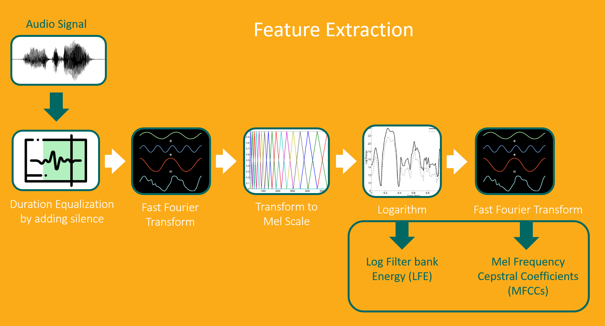

  

# Extracting Features

  

This file contains instructions for extracting features from datasets. The extracted features will be saved as .joblib format. The feature_extraction.py script can be used for extracting Mel-frequency cepstral coefficients (MFCC) or Log Mel Filterbank Energy (LMFE). The feature extraction procedure is illustrated in the following figure.



Various libraries can be used for MFCC extraction. The MFCC feature extraction technique includes windowing the signal, applying the discrete Fourier transform (DFT), taking the log of the magnitude, and then warping the frequencies on a Mel scale, followed by applying the inverse discrete cosine transform (DCT.)
The Log Filterbank Energy is obtained by applying filter banks to the signal periodogram. They are an intermediate step in obtaining MFCCs. Therefore, they have a higher correlation than MFCCs, but in some cases, they retain a more significant amount of information from the original signal. 

Sequential model needs only either [MFCC](https://en.wikipedia.org/wiki/Mel-frequency_cepstrum#:~:text=In%20sound%20processing,%20the%20mel,collectively%20make%20up%20an%20MFC.) or LMFE for emotion detection, while both MFCC and LMFE are required for the siamese model. However, sequential model expects the mean of the MFCC/LMFE. It's notable that MFCC seems to reveal more information than MFCC. Therefore, it's highly recommended to use MFCC for training the sequential model.

  

For extracting aforementioned features, one can define the number of coefficients (in case of MFCC) or filterbanks (in case of LMFE). These parameters can be configured in the configuration file. For more information, please check the training_parameters.yml file details.

  

## Usage

  

from the root directory (Audio-Sentiment-Analysis) execute below command:

  

```python training/feature_extraction.py [desired_feature]```

  

>  [desired_feature] can be "mfcc", "lmfe", "mfcc_sequential", or "lmfe_sequential"

  

***Note:***

Feature_extraction.py uses some of the parameters in the training_parameters.yml file. Therefore, you need to update this file before executing this script.

  

## Required Parameters

the training_parameters.yml file constains multiple parameters. However, the below parameters are required for feature extraction.

  

-  **n_mfcc**: The number of coefficients required for extracting MFCC feature.

-  **n_lmfe**: The number of filterbanks to be used in LMFE extraction.

-  **raw_train_data_directory**: The path to the directory containing dataset (audio tracks in the form of **.wav**) required for training purpose

- ***raw_test_data_directory:*** The path to the directory containing dataset (audio tracks in the form of **.wav**) required for testing purpose

- ***raw_validation_data_directory:*** The path to the directory containing dataset (audio tracks in the form of **.wav**) required for validation purpose

-  ***chunk_length_in_milli_sec:*** As a preprocessing step, we assumed that all audio tracks should be in the same length. Using this feature, you can configure the desired length in milliseconds.

-  ***Note***: This length should be at least the same size as the longest audio file in your dataset.

  

Here you could find a sample:

  

    model_type: "Sequential"
    
    parameters:
    
	    model_generator: "sequential_three_conv_modules_generator"
	    n_conv_filters: [32, 128, 256]
	    filters_shape: [5, 5, 5]	    
	    input_shape: [50, 1]	    
	    n_emotions: 5	    
	    n_mfcc: 50	    
	    n_lmfe: 26	    
	    adam_lr: 0.005	    
	    batch_size: 8	    
	    epochs: 1
	    trained_models_dir: "./prod_models/candidate"	    
	    trained_model_name: "seq_3conv_modules_5emotions"	    
	    feature_train_data_directory: "./data/features/Sequential_5emotions/train"	    
	    feature_test_data_directory: "./data/features/Sequential_5emotions/test"	    
	    feature_validation_data_directory: "./data/features/Sequential_5emotions/validation"	    
	    raw_train_data_directory: "./data/tone_5_emotions_dataset_v1/train"    
	    raw_test_data_directory: "./data/tone_5_emotions_dataset_v1/test"	    
	    raw_validation_data_directory: "./data/tone_5_emotions_dataset_v1/validation"	    
	    chunk_length_in_milli_sec: 7000

  

## Required Libraries

  

For extracting LMFE, [python_speech_feature](https://python-speech-features.readthedocs.io/en/latest/) is used.

  

for extracting MFCC, [librosa](https://pypi.org/project/librosa/) is used.
