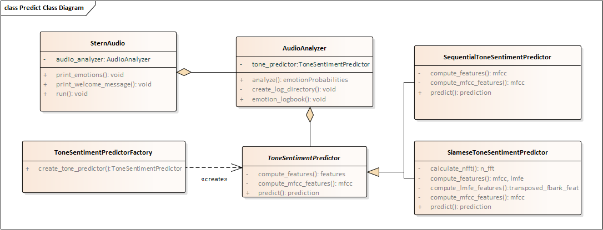

## Sentiment analysis prediction

This document describes the audio sentiment analysis prediction module. In the following sections, we present its design, configuration, and usage. 

### Design
The sentiment analysis prediction module uses a tone-based CNN model to detect sentiment (emotions) in audios. The components of this prediction module are shown in the figure below. Overall, these components belong to one of the following types: prediction engine, audio analyzer, and tone-based sentiment predictor. The implementation of the components in the class diagram is available in the ```src``` folder of the source code. 




#### Prediction engine
The prediction engine is the component that handles the general audio sentiment analysis process. It interacts with the users to record audio and displays the emotions predict for each recorded audio. The ```SternAudio``` class represents this prediction engine. 

Overall, ```SternAudio``` performs the sentiment analysis process in a loop as follows:
1. record audio from a microphone
2. analyze the recorded audio
3. show the emotions resulting from the analysis
4. pause for a short period before recording the next audio (step 1)

The ```SternAudio``` class uses the ```AudioAnalyzer``` class to perform the audio analysis operation. The behavior of the prediction loop can be altered by modifying the following properties in the configuration file: ```audio_length```, ```audio_frequency```, ```audio_channels```, ```before_recording_pause```, ```after_audio_analysis_pause```, and ```iterations```. In the next section we describe the contents of the configuration file.

#### Audio analyzer
The audio analyzer functionality, which is described by the ```AudioAnalyzer``` class, uses a tone-based sentiment predictor to compute the emotions associated with a given audio. The computed emotions are then preprocessed to generate human-readable messages that will be presented to the users of the sentiment analysis prediction module. In addition, the computed emotions are logged in a file specified by the user.

The behavior of the ```AudioAnalyzer``` can be altered by modifying the following properties in the configuration file: ```audio_frequency```, ```emotions```, ```logging_file_prefix```, and ```logging_directory```. In the next section we describe the contents of the configuration file.

#### Tone-based sentiment predictor
The tone-based sentiment predictor component is responsible for computing features from a recorded audio and analyzing these features to predict its emotions. In the class diagram shown above, this component is represented as the ```ToneSentimentPredictor``` class. As shown in the class diagram, two specialized tone-based sentiment predictors inherit from this class: ```SequentialToneSentimentPredictor``` and ```SiameseToneSentimentPredictor```. 

The ```SequentialToneSentimentPredictor``` class uses sequential CNN models trained with mfcc features. Therefore, in order to perform sentiment prediction using its CNN model, this class computes mfcc features of a given audio. In contrast, the ```SiameseToneSentimentPredictor``` uses siamese CNN models trained using mfcc and lmfe features. Thus, this class computes mfcc and lmfe features in order to predict the sentiment of a given audio.

The ```src``` folder contains only the ```SequentialToneSentimentPredictor``` and ```SiameseToneSentimentPredictor```. The ```ToneSentimentPredictor``` class is part of the design but was not implemented. Nonetheless, if more tone-based predictors classes are required, the ```ToneSentimentPredictor``` could be implemented in order to couple the functionality of new tone-base predictors with the required interface.

The behavior of the implemented tone-based predictor classes can be altered by modifying the following properties of the configuration file: ```prod_models_dir```, ```model_dir```, ```model_name```, ```model_type```, ```audio_frequency```, and ```n_mfcc```. In the next section we describe the contents of the configuration file.

### Configuration
**TODO**


### Usage
**TODO**

### Modify or remove
It requests input from the users of the prediction module and displays the results of the prediction process. 


The sentiment analysis prediction module, described in the class diagram shown in the figure below, can be used to analyze audio recordings captured from a microphone. As shown in the figure below, this module consists of three main elements: 
* the ```SternAudio``` class manages the overal audio sentiment analysis process
* the ```AudioAnalyzer``` class takes a recorded audio and uses a ```ToneSentimentPredictor``` instance to compute the corresponding emotions
* the ```ToneSentimentPredictor``` class performs the sentiment analysis detection according to the type of model configured by the user.


The implementation of this prediction module is available in the ```src``` directory. 
composed of the scripts and files in the ```src``` directory, 

 The figure below shows the class diagram of this module. The behavior of this module can be adjusted using one of the following configuration files ```raspi_candidate_config.yml``` and ```raspi_deployment_config.yml```. For development purposes the candidate configuration file should be modified, but when deploying code on the Raspberry Pi, the deployment configuration file should be modified.

 


### SternAudio 
This class is responsible for managing the overal audio sentiment analysis process. 

The sentiment analyis process is executed in a loop that performs the following operations:
1. record audio from a microphone
2. analyze the recorded audio
3. show the emotions resulting from the analysis
4. pause for a short period before recording the next audio

Inside this loop, the analysis of the recorded audios is performed using an instance of the ```AudioAnalyzer``` class. In addition, the behavior of the operations in the loop depends on the following properties of the configuration files (```raspi_candidate_config.yml``` or ```raspi_deployment_config.yml```):

* audio_length: Length (in seconds) of the audios to be recorded. TODO
* audio_frequency: number of hertz used to record audios. The Raspberry Pi supports 44,100 hertz.
* audio_channels: number of channels used to record audios
* before_recording_pause: number of seconds to pause after showing a message that indicates the next audio will be recorded
* after_audio_analysis_pause: number of seconds to pause after the sentiment prediction values are displayed
* iterations: number of audios to be recorded and analyzed. The value -1 indicates an infinite number of iterations.


* prod_models_dir: path of the directory that contains tone-based sentiment analysis models
* model/dir
* model/file
* model/type
* audio_frequency

recording audio from a microphone and analyzing it. The procedure is executed in a loop that can run for a finite number of iterations or  

