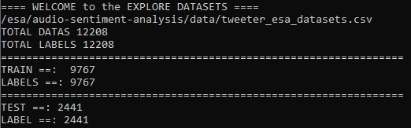
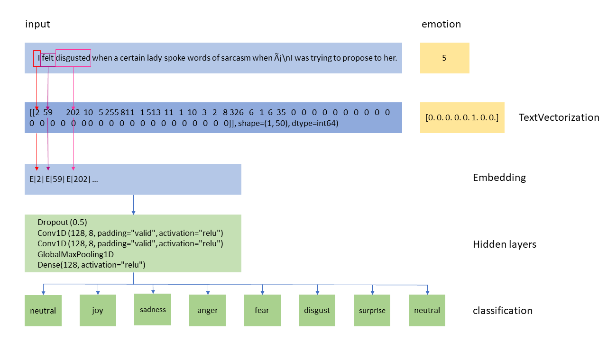

Text classification, Natural Language Processing (NLP) task such as sentiment analysis, categories text according to its content into eight emotions such as ` [01 = neutral, 02 = calm, 03 = happy, 04 = sad, 05 = angry, 06 = fearful, 07 = disgusting, 08 = surprised].`

This folder contains ` sentiment_analysis_text_based_model.py` and ` train_text_based_neural_network.py ` scripts. 

:one: How to build the text-based neural network and train the network. 

`train_text_based_neural_network.py` script is used to build the neural network and to train the network on training datasets and to validate the network on validating datasets. The script contains the following functions:

- **prepare_data(input_file_name)**

The dataset is created by combining three datasets, [MELD](https://affective-meld.github.io/), [ISEAR](https://github.com/sinmaniphel/py_isear_dataset), and [Tweet](https://github.com/shaypal5/awesome-twitter-data#id8), with labeled eight emotions. For equal emotion distribution, the datasets are shuffled with random seed = ` 1337`. The text dataset is split into training and validation datasets with the proportion of 80 and 20 percent respectively. The figure shows the total number, `12,208`, and split. 



- **build_model()**

Convolutional Neural Network (CNN) and Recurrent Neural Network(RNN), especially LSTM, architecture approach are used to build the text-based model. The latest text-based model with (LSTM) has **48.79** percent val_accuracy. 

- **train_model()**

The neural network is trained with a training dataset with hyperparameters. The following parameters are used in the latest model. 
``` 
Text vectorization:
    max_features = 20000
    embedding_dim = 128
    sequence_length = 20
 Model training:
    learning_rate=0.001
    loss='categorical_crossentropy'
```
A text [vectorization](https://www.tensorflow.org/api_docs/python/tf/keras/layers/experimental/preprocessing/TextVectorization) is used to vectorize the text. 

``` 
    vectorizer = TextVectorization(max_tokens=max_features, output_mode="int", output_sequence_length=sequence_length)
    vectorizer.adapt(train_samples)
    vectorizer.adapt(test_samples)
```
The vectorization layer is called by adapt() method on a dataset. When this layer is adapted, it will analyze the dataset, determine the frequency of individual string values, and create a 'vocabulary' from them. This vocabulary can have an unlimited size or be capped, depending on the configuration options for this layer; if there are more unique values in the input than the maximum vocabulary size, the most frequent terms will be used to create the vocabulary. The text vectorization is illustrated in the following figure.



- **save_model()**

The trained model is named `emotion_text_model` with `.pb` extension and saved in the `prod_models` folder. 

Furthermore, the script contains the Emotion class which checks labels of emotions.

In order to run the `train_text_based_neural_network.py` script, please follow the following instructions:
```
   1. Navigate to prototype folder 
   2. Check dataset file with `.cvs` extension. 
   3. Execute the command
```

```
python train_text_based_neural_network.py [dataset file path]
```


:two: How to use the trained text-based model 

` sentiment_analysis_text_based_model.py` is used to analyze the sentiment of the given text.

The script contains the following functions:
- **load_model()**

To load the trained text-based model, which is named `emotion_text_model`, from `prod_models` folder. 

- **load_text(input_file)**

To load the given input text from `input_file`.

- **predict_emotion()**
To analyse the sentiment of the given text.

Furthermore, the script contains the Emotion class which checks labels of emotions.

In order to run the `sentiment_analysis_text_based_model.py` script, please follow the following instructions:
```
   1. Navigate to prototype folder 
   2. Check the input file with `.txt` extension. 
   3. Execute the command
```

```
python sentiment_analysis_text_based_model.py [input_text file path]
```
